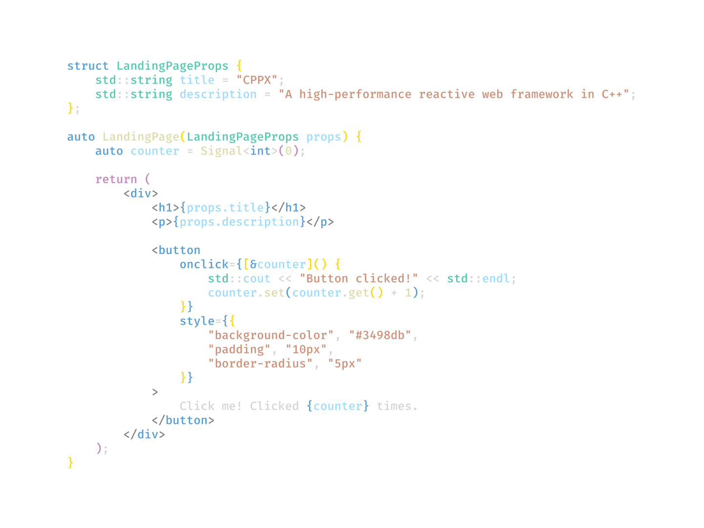

<h1 align="center">CPPX</h1>

 <a href="#key-features">Key Features</a> &#xa0; | &#xa0;
  <a href="#author">Author</a>

CPPX is a web framework that brings the power of C++ to reactive web development. It combines the performance benefits of C++ with modern web development paradigms, offering a unique solution for building high-performance, interactive web applications.

<h2 id="key-features">Key Features</h2>

**🌎 Native HTML Support**: CPPX allows developers to write HTML-like syntax directly within C++ files, similar to JSX in React. This feature employs a custom preprocessor that translates the HTML-like code into efficient C++ instructions for DOM manipulation, enhancing code readability and maintainability while streamlining the development process.

**🦄 Native JSON Support**: With CPPX, working with JSON data becomes as natural in C++ as it is in JavaScript. The framework includes a powerful JSON library that enables developers to parse, create, and manipulate JSON objects directly within their C++ code, significantly simplifying data handling and improving overall performance compared to runtime JSON parsing.

**⛓️‍💥 Reactive Rerendering**: CPPX implements a sophisticated event handling system that bridges client-side interactions with server-side logic through an efficient signaling mechanism. This system ensures seamless integration between client-side events and server-side logic, providing efficient updates with minimal data transfer and real-time reactivity without full page reloads.

  Made with ❤️ by <a href="https://github.com/danielbacsur" target="_blank">Daniel Bacsur</a>

